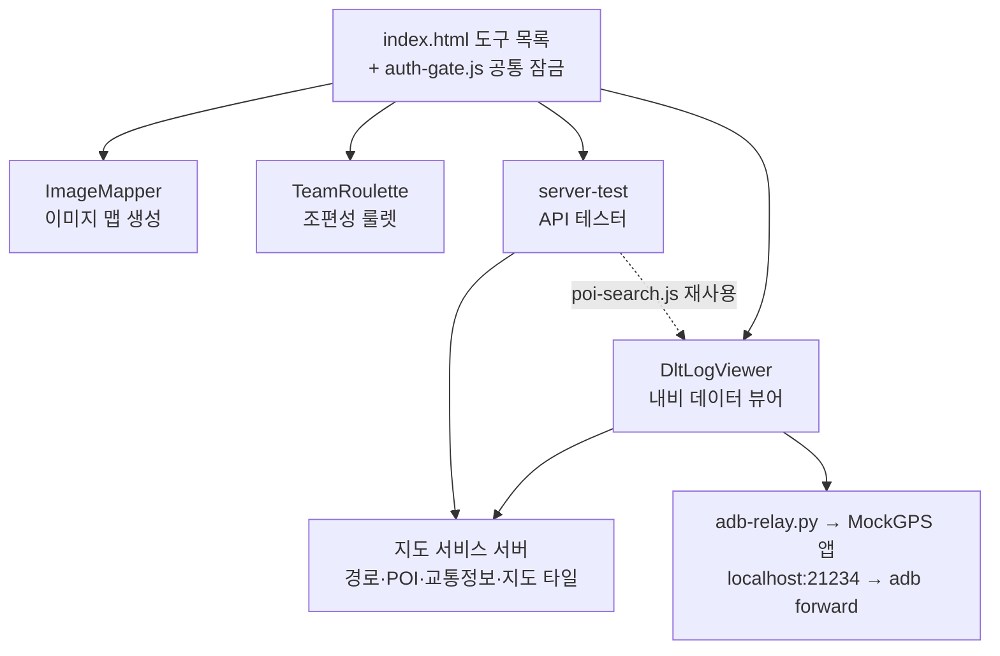
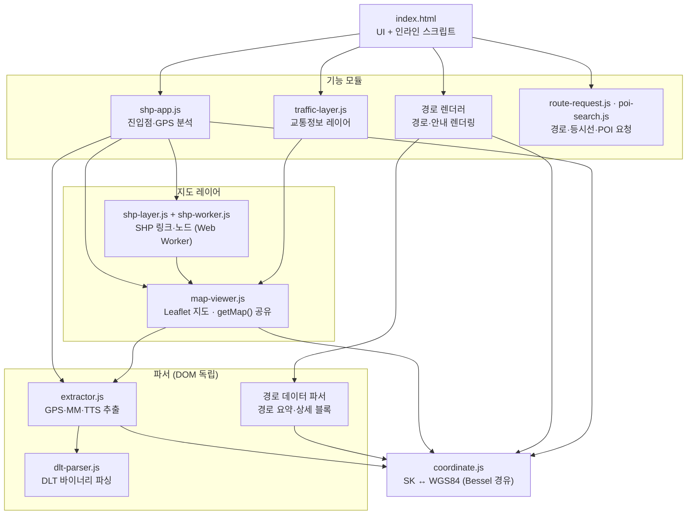

# honor436.github.io

사내 개발·검증용 도구 모음. 빌드 단계 없는 정적 사이트로, GitHub Pages에 그대로 배포된다.

## 전체 구조



| 경로 | 설명 |
|---|---|
| `index.html` | 도구 목록 페이지 |
| `auth-gate.js` | 모든 페이지가 로드하는 공통 비밀번호 잠금 |
| `DltLogViewer/` | 내비 데이터 뷰어 (운영) |
| `DltLogViewer-beta/` | 뷰어 검증용 복사본 — 기능을 여기서 먼저 검증한 뒤 운영에 반영 |
| `ImageMapper/` | 이미지 영역 지정·1MB 단위 분할 이미지 맵 생성기 |
| `TeamRoulette/` | 조편성 룰렛 (뽑힌 사람은 휠에서 제거) |
| `server-test/` | 경로·POI 요청 편집/전송 테스터 |
| `tests/` | `node:test` 기반 단위 테스트 |
| `graphify-out/` | 코드 지식 그래프 (커밋 시 자동 갱신) |

도구끼리는 서로 import하지 않는다. 예외로 `server-test/tester.js`가 `DltLogViewer/js/poi-search.js`를 재사용한다.

## DltLogViewer 모듈 계층

DLT 바이너리 로그에서 GPS/MM 위치, 경로 요청, 음성안내(TTS) 로그를 추출하고 SHP(링크/노드) 데이터와 함께 지도에 시각화한다. 위 계층이 아래 계층을 import한다.



- **진입점 두 곳**: `<script type="module">`로 로드되는 `shp-app.js`, 그리고 여러 모듈을 직접 import하는 `index.html` 인라인 스크립트.
- **지도 인스턴스 공유**: `shp-layer`, `traffic-layer`, `shp-app`은 서로 import하지 않고 `map-viewer.js`의 `getMap()`으로 같은 지도를 얻는다. `initMap` 재호출 시 지도가 새로 만들어지므로, 이전 지도에 붙인 이벤트는 `map-init` 이벤트로 다시 붙여야 한다.
- **파서 계층은 DOM 독립**: `dlt-parser`, `extractor`, 경로 데이터 파서는 순수 로직이라 `tests/`에서 직접 검증한다.
- **보조 모듈**: `mock-gps-playback.js`(궤적 보간), `reverse-geocode.js`, `build-info.js`는 `index.html`에서만 쓴다.
- **로컬 릴레이**: `adb-relay.py`는 브라우저 밖에서 실행하는 Python 서버로, 브라우저 → HTTP(21234) → adb forward → MockGPS 앱으로 모의 위치를 전달한다.

## 개발

```bash
npm test
```

- Node 18+ 내장 `node:test` 러너 사용. 개발 원칙(TDD)과 회귀 테스트 필수 케이스는 [CLAUDE.md](CLAUDE.md) 참고.
- 새 클론에서는 그래프 자동 갱신 훅을 한 번 활성화한다: `git config core.hooksPath .githooks`
